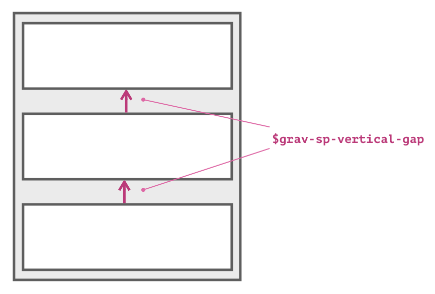
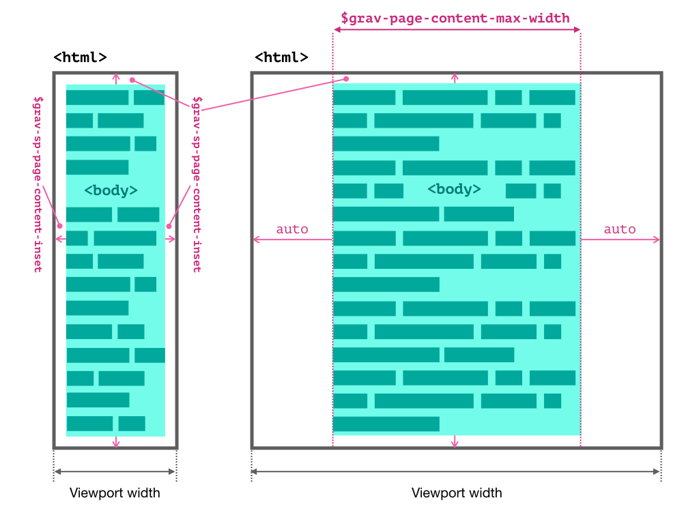
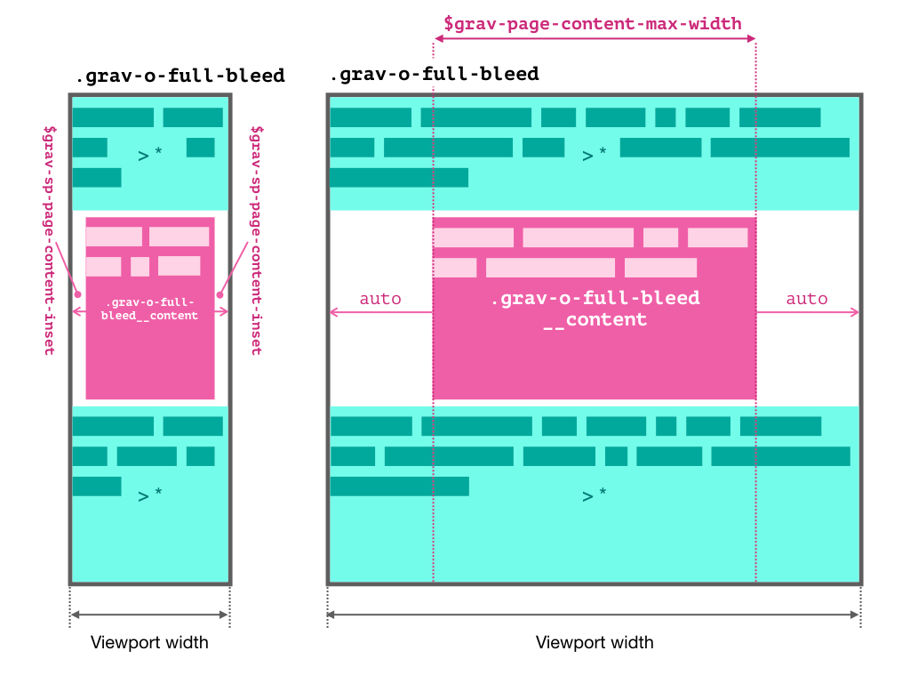

# Layout and grids

<!--
  Tip: If using VSCode, get the "Auto Markdown TOC" extension by
  Hunter Tran to automatically update this table of contents.
  https://github.com/huntertran/markdown-toc
-->
<!-- TOC depthfrom:2 -->

- [Per-component rules](#per-component-rules)
- [Vertical spacing and typography defaults](#vertical-spacing-and-typography-defaults)
- [Horizontal page layout](#horizontal-page-layout)
    - [Full-bleed layouts](#full-bleed-layouts)
- [Sticky footer](#sticky-footer)
    - [Default on `<body>`](#default-on-body)
        - [Disabling the default](#disabling-the-default)
    - [Enabling for non-body root containers](#enabling-for-non-body-root-containers)

<!-- /TOC -->

## Per-component rules
The following rules are designed to enable maximum re-use and flexibility of UI components. They also make it easier for future Gravity releases to evolve the overall look and feel, without needing to make lots of per-component changes.

All UI components should:

* **Participate in the normal layout flow**
    * In other words, they should not themselves use things like absolute positioning, be floated or any other CSS technique that takes them out of the normal layout flow.
    * They can and should of course use whatever layout techniques they like internally to lay out their respective child elements and nested components.
* **Not set an explicit width on themselves**
    * Block components should expand horizontally ot fill the space provided by their parent. So standard `display: block;` behaviour or equivalent.
    * Non-block components (e.g. inline ones) should expand horizontally to fit their content
* **Not set an explicit height on themselves**
    * Content within a component must always be fully accessible and should therefore never be cropped or obscured. Generally, the easiest way to achieve this is to simply allow elements to follow their natural behaviour of expanding vertically to fit the content within them.
* **Not set explicit outer margins on themselves**
    * It is the responsibility of global rules and/or parent components to set correct spacing between components. If individual components were to set explicit margins themselves, that would interfere.
* **Not hard code values for space, borders, sizes, etc.**
    * Most of the time the inherited defaults will set the correct widths, heights, font-sizes, etc., so those properties should not be explicitly set unless you intentionally want to override the default.
    * When you do override properties, never hard code the values but instead reference the appropriate SASS variable or CSS custom property provided by Gravity. For instance, don't do `padding: 1rem;` but instead do `padding: $grav-sp-m;`.
    * If none of the available variables give you what you need, please contact the [Gravity maintainers](https://github.com/orgs/buildit/teams/gravity-maintainers) - if there's a good case for it, we can always add more global variables so that others can also benefit from them.
    

## Vertical spacing and typography defaults
Our CSS approach is inspired by [Heydon Pickering](http://www.heydonworks.com/)'s "[Axiomatic CSS and Lobotomized Owls](https://alistapart.com/article/axiomatic-css-and-lobotomized-owls)" article.

We therefore have a global "lobotomized owl" (`* + *`) CSS rule that sets a default vertical `margin-top` _between_ successive block elements, but not above the first element. Components and pages are encouraged to just let this rule do its thing as much as possible and only selectively override it when absolutely necessary.



The SASS variable `$grav-sp-vertical-gap` defines the size of this standard vertical gap.

Similarly, all components inherit `font-family` and `line-height` by default. As much as possible you should accept these values. Only override them when you have good reason to do so.


## Horizontal page layout
By default, the `<body>` element has a small outer margin (defined by `$grav-page-content-inset`) on all sides, so that oage content doesn't touch the edges of the screen or browser window. Furthermore, once the viewport exceeds a certain width, the `<body>` element gets locked to a fixed width (defined by `$grav-page-content-max-width`) and appears centered within the viewport.



### Full-bleed layouts
The default page layout behaviour can be overridden by adding the `.grav-o-full-bleed` class to the `<body>` element. This will remove _all_ margins and remove the `<body>`'s `max-width`. Elements within will therefore fill the entire width of the viewport - i.e. be "full bleed". There will also no longer be a margin above and below the first and last elements respectively.

If you want to "box in" specific child elements so that they have the same horizontal behaviour as `<body>` does by default - i.e. small margins left and right on narrow viewports and a centered with a fixed width on wider viewports - you can do so by adding the `.grav-o-full-bleed__content` class to them.



Note that **nesting elements with `.grav-o-full-bleed__content` is not supported** as it will create oversized margins on small viewports.


## Sticky footer
Gravity provides various means for having "sticky" page footers, i.e. a page footer that "sticks" to the bottom of the viewport on short pages where it would otherwise appear higher up. On pages with enough content to be taller than the viewport, the page scrolls as usual with the footer appearing at the end.


### Default on `<body>`
Pages whose footers are direct children of the `<body>` element will have the sticky footer behaviour by default.

```html
<!DOCTYPE html>
<html lang="en">
  <head>...</head>

  <body>
    ...

    <footer>
      This page footer will be sticky by default!
    </footer>
  </body>
</html>
```

#### Disabling the default
If the sticky footer is _not_ desired in the above scenario, you can disable it by adding the `.grav-o-sticky-footer--unstick` class to the `<body>` element.

### Enabling for non-body root containers
If your page contents, including the footer, are not direct children of `<body>`, but instead nested in some other top-level container, you can enable the sticky footer behaviour by adding the `.grav-o-sticky-footer` class to the _container_ that is the immediate parent of the page footer. This can be useful for single page apps (SPA), that often use a `<div>` container _within_ `<body>` to wrap the app's contents.

```html
<!DOCTYPE html>
<html lang="en">
  <head>...</head>

  <body>
    <!--
      This DIV is the "root" container of the app.
      Normally, the footer within will not be sticky.
      But, adding the .grav-o-sticky-footer class
      reinstates this behaviour
    -->
    <div id="root" class="grav-o-sticky-footer">
      ...

      <footer>
        This page footer will be sticky!
      </footer>
    </div>
  </body>
</html>
```
